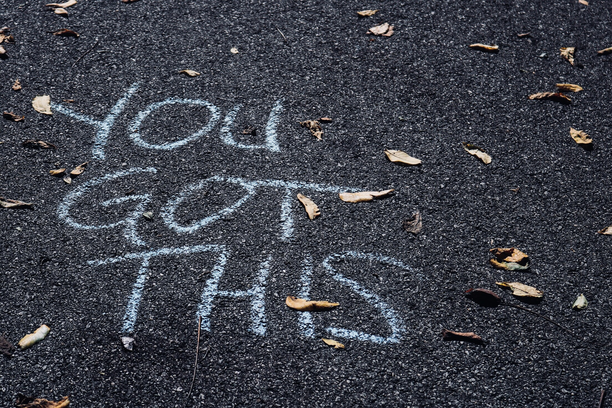

I love to write. I used to write in my college days using Google's Blogger platform. I never wrote consistently but whenever I did, I felt good about it.


This love for writing carried over to my office days. I wrote documentation for the projects I work on. I think my teammates found it useful. Maybe you can ask them to find out the truth :P

So here I am, trying to take my love for writing and mixing in some consistency so that I can write more often. I hope I can inspire or help someone else who comes across these. So here are a few thoughts about how I write articles.

### Choosing a topic

Choosing a topic may feel like a huge task, but it isn't. Anything that happens in your day can be a topic for your blog. It could be something related to work. It could be something interesting you learnt that day. Or it could be something to do with your hobbies.

_The only catch is that you have to recognize these moments in your day. This is easier said than done._

Sometimes when I explain something to a friend, my mind goes "Well, there may be others who would like to know how this works!". That's my cue and I have my topic. This kind of awareness takes some practice initially, but it will become second nature as you continue to do it.

### What kept me from writing

If all we needed was a topic, then we would have so many more writers in our daily circles. But that's not enough these days. What's keeping us from writing is ourselves.

_Someone else better than me would have already written this, so it's not worth writing. After all, I'm just me right?_

I am sure many of us have this thought. This creates just enough friction in our mind that we accept it and move on with our lives. Why didn't I do the same this time?

There was one idea which changed my outlook on this. Someone on twitter (I'm sorry I forgot who it was) wrote, "Write even if you feel that others have written about it previously. This is because there will always be someone who is just getting started to what you're writing about, and your content might enable them to get started."

Whew, huge weight off my shoulders! So yes, I'm writing for the others who are starting out on the same path as me.



### Jot down the main thoughts

The moment I have the topic in mind, I get to my laptop and write a few points. This is just like taking quick bullet point notes when listening to a lecture. Its like a todo list of items that I think are relevant to the topic. This may be very poorly worded, doesn't have to be proper english either. Its just a way of ensuring that I include all of those points in the blog. Here's the list for this article, (warning: bad english ahead)

```noLineNumbers
- for me no set schedule
- jot down the main points that I remember
- whenever I get time I come back and try to elaborate on the points
- sometimes need to rearrange, think of the overall structure
- make sure grammar and spellings are decent
- add headings
- find relevant images from unsplash
- topic - write about whatever you like to write about - twitter reference
- write, because there will always be someone who is just getting started
```

Here you can use whatever device - be it digital or analog - to capture the thoughts. Just make sure that it is easily accessible and very simple to do. If its difficult - like you need to turn on the computer, then open up Word and then write - then you may feel lazy and decide not to do it.

Once I have this, I come back whenever I get time and try to flesh it out into a proper structure. Most of the time I rearrange the ordering. I also add headings to make it more organized.

Sometimes I remember other main points during this process and I include those into the list.

### Final beautification


For me the main part of proofreading is to make sure grammar and spellings are correct. When I read through it again, if it feels like I didn't convey my thought correctly at any section, I rephrase it so the correct idea is conveyed.

Then I find find relevant images from [unsplash](https://unsplash.com/). It is a free resource to find stunning images and I think you will agree that it enhances your reading experience. :)

---

To everyone holding back from writing because of fear or judgement, I don't think you should worry too much about what others may say. After all, it is your personal blog. You should write about topics you are interested in, and be yourself. Accept genuine feedback, and throw away negative feedback.

You can reach out to me on Twitter - [@johnjacobkenny](https://twitter.com/johnjacobkenny) or subscribe to [get notifications for new content](http://eepurl.com/g5wm65)
